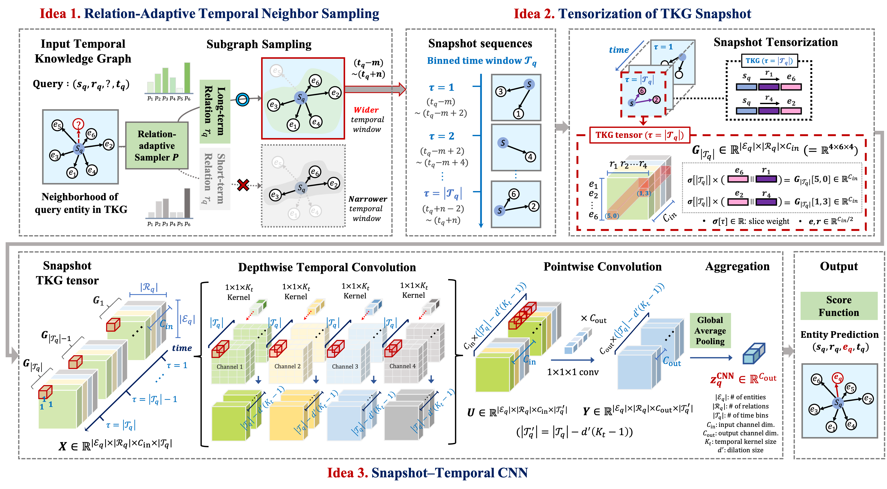

# Tirano

This is the official implementation of "Relation-aware Temporal Reasoning for Tensor-based Knowledge Graph Completion". 

## Overview of Tirano


## Abstract

Given a partially observed Temporal Knowledge Graph (TKG), how can we accurately predict its missing entities? Unlike static knowledge graphs, TKGs inherently represent facts within specific temporal contexts. Numerous methods have been developed to tackle the Temporal Knowledge Graph Completion (TKGC) task, which focuses on predicting missing entities in temporal facts. However, existing models typically rely on short-term temporal neighbor sampling strategies and fail to adaptively construct relation-specific temporal subgraphs. In addition, current snapshot-based temporal encoding techniques often compress snapshots into a single time series by encoding them sequentially, capturing only global temporal trends while overlooking localized event patterns—particularly those tied to relation-specific temporal dynamics.

In this paper, we propose Tirano (Relation-aware Temporal Reasoning for Tensor-based Knowledge Graph Completion), an accurate tensor-based temporal reasoning method in TKGC. Tirano selectively samples the most relevant neighbors for each query, effectively constructing cleaner subgraphs that reduce computational overhead and eliminate noisy context. Furthermore, Tirano proposes a CNN-based snapshot temporal encoder enhanced with time-decay weighting, which emphasizes temporally closer and relation-aware events. This design enables efficient modeling of temporal activation patterns of entity–relation pairs while preserving time-sensitive structural signals across adjacent snapshots. Extensive experiments on real-world benchmark datasets demonstrate that Tirano consistently outperforms state-of-the-art TKGC methods, achieving up to 4.79%p higher accuracy.

## Requirements
We recommend using the following versions of packages:
- torch>=2.2.0
- numpy==1.24.4
- tqdm==4.66.5
- pandas==2.0.3
- scikit-learn==1.3.2
- scipy==1.10.1

## Data Overview
We utilize four benchmark datasets for TKGC. To get started, download each dataset from the provided official links.
|        **Dataset**        |                  **Link**                   |
|:-------------------------:|:-------------------------------------------:|
|       **ICEWS14**        |           `https://dataverse.harvard.edu/dataverse/icews`           |
|       **ICEWS18**        |           `https://dataverse.harvard.edu/dataverse/icews`           |
|       **ICEWS05-15**        |           `https://dataverse.harvard.edu/dataverse/icews`           |
|       **GDELT**        |           `https://www.gdeltproject.org/`           |


## How to Train
To train the model for demo, run the following command:
```
python main.py --dataset {DATASET}
```

## How to Test
To evaluate a trained model, please run:
```
python main.py --dataset {DATASET} --test --resume --name {CHECKPOINT_NAME}
```


